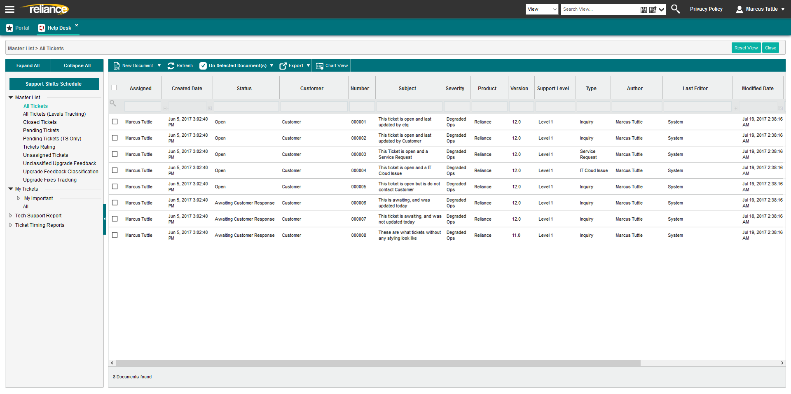
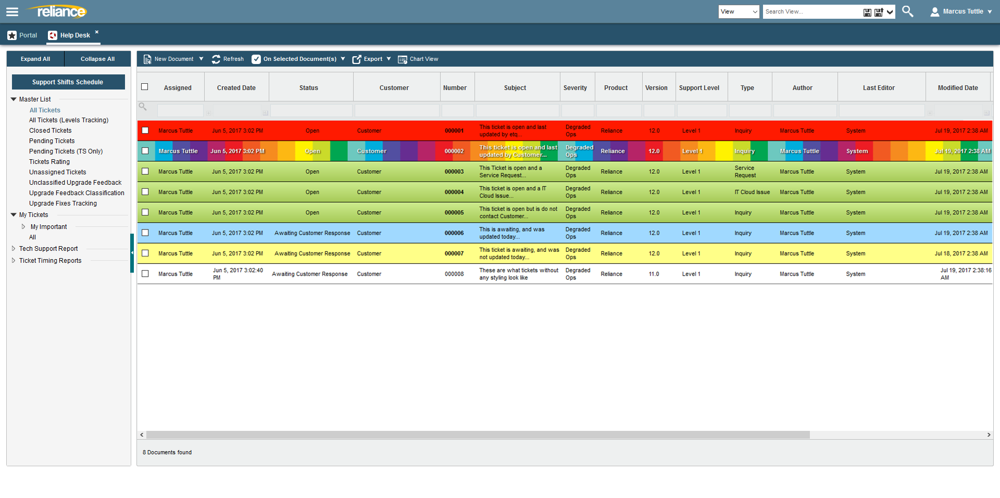

  

# RainbowCORE

A small JavaScript, JQuery, and CSS based extension that allowed EtQ Support Techs to highlight ticket rows and customize their EtQ CORE HelpDesk views within EtQ Reliance

These files rely and use the [Greasemonkey FireFox Extension](https://addons.mozilla.org/en-US/firefox/addon/greasemonkey/) and/or the [Violentmonkey Firefox Extension](https://addons.mozilla.org/en-US/firefox/addon/violentmonkey/). 

## No Longer being updated and Supported

I had a fantastic time working on this project, but sadly the project will be coming a close. The development of RainbowCORE was to make front-end changes and design changes to an internal product used at EtQ. Nov 11, 2017, marks my departure from EtQ. This means I will no longer have access to any of the internal products, and also means I will no longer be able to test RainbowCORE against the product it was designed to work with.

This project has been very fun, and I hope that its current state will continue to provide help or knowledge to others.

## Getting Started

* [Install Guide (Firefox 56.0 and earlier)](guides/RainbowCORE_Install_Guide_Greasemonkey.pdf)
* [Install Guide (Firefox 57.0)](guides/RainbowCORE_Install_Guide_Violentmonkey.pdf)
* [Upgrade Guide](guides/RainbowCORE_Upgrade_Guide.pdf)
* [Upgrade 1.0 to 1.1 Guide](guides/RainbowCORE_Upgrade_Guide_1.1.pdf)
* [FireFox Quantum (57.0) Fix Guide](guides/RainbowCORE_Firefox_57.pdf)
* [Legend](guides/RainbowCore_Legend.png)

## Current Views Supported

- All Tickets
- Pending Tickets (TS Filtered)
- Pending Tickets (TS Only)

## Previews

### Before using the extension

### After using the extension

## Disclaimer 

Reliance is software developed and owned by [EtQ, Inc.](http://www.etq.com/)

All products, names, logos, and brands are property of their respective owners.

I developed this in a personal capacity. The views, projects, and ideas expressed are of my own, and do not represent the views of any other company, their products, or anyone else. Any information gathered from this project is at your own risk. This was developed for personal gain and is not permitted to be used or sold in anyway.

If anyone has any issues with this project, please feel free to contact me directly at contact@marcustuttle.com

